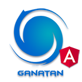

 # Angular 12 / Bootstrap 5 & CRUD REST API

<table>
<tr>
<td>
  <a href="https://www.ganatan.com/en">
    
  </a>

it's a repo designed to create a **Web Application with Angular 11**


* Frontend - [**Angular 12.2.0**](https://github.com/angular/angular/releases) & [**Angular CLI 12.2.0**](https://github.com/angular/angular-cli/releases/)

* UI prototype - [**bootstrap 5**](https://v5.getbootstrap.com/docs/5.0/getting-started/download/) 

* Backend - CRUD REST API [**PostgreSQL**](https://www.postgresql.org/download/)

* See the [**Live demo**](#live-demo), Test the repo with [**Quick start**](#quick-start) and for more information Read the step by step [**Tutorial**](#tutorial) or read the [**Getting started**](#getting-started)


</td>
</tr>
</table>

# [Live Demo](#live-demo)
Here is a working live demo :  https://angular.ganatan.com/


<p align="center">
  <p align="center">
    <a href="https://angular.ganatan.com/">
      
    </a>
  </p>
</p>


## Lighthouse Audit


## Table of contents

- [Status](#status)
- [Quick start](#quick-start)
- [Front-end](#front-end)
- [Back-end](#back-end)
- [Author](#author)
- [Documentation](#documentation)

### Front-end : What's included
> Dependencies
- [x] Angular : 12.2.0
- [x] Angular CLI : 12.2.0
- [x] Angular Universal : 12.1.0
- [x] Bootstrap : 5.1.0
- [x] Fontawesome : 5.15.4

> Features
- [x] Routing
- [x] Lazy Loading
- [x] Server Side Rendering
- [x] Progressive Web App
- [x] Responsive Layout
- [x] Search Engine Optimization (SEO)
- [x] Components
- [x] Services
- [x] Reactive Form
- [x] Template Driven Forms

## Quick start

```bash
# select a repo from github, gitlab or bitbucket

# download the example or clone the repo from github
git clone https://github.com/ganatan/angular12-app.git

# download the example or clone the repo from gitlab
git clone https://gitlab.com/ganatan/angular12-app.git

# download the example or clone the repo from bitbucket
git clone https://bitbucket.org/ganatan/angular12-app.git

# change directory
cd angular12-app
cd frontend

# install the repo with npm
npm install

# start the server
npm start

```
in your browser go to [http://localhost:4200](http://localhost:4200) 


## Front-end

### Installation
* `npm install` (installing dependencies)
* `npm outdated` (verifying dependencies)

### Developpement
* `npm run start`
* in your browser [http://localhost:4200](http://localhost:4200) 


## Tests
* `npm run lint`

## Tests prerequisites
- ChromeDriver only supports Chrome version 89

### Compilation
* `npm run build`       ( without SSR)
* `npm run build:ssr`   ( with SSR)

### Production
* `npm run serve:ssr`
* in your browser [http://localhost:4000](http://localhost:4000) 

### Bootstrap UI
* `change directory` cd ui (Bootstrap 5)
* Launch html pages in your browser


## Back-end

### Back-end : What's included

> Tools
- [x] mysql-express-batch (with Node.js)
- [x] mysql-sql (with SQL Scripts)

- [x] postgresql-express-batch (with Node.js)
- [x] postgresql-express-crud (with Node.js and Express)
- [x] postgresql-sql (with SQL Scripts)

> Features
- [x] Database Creation
- [x] Domains Creation (only PostgreSQL)
- [x] Tables Creation
- [x] Importing Data
- [x] Exporting Data
- [x] Serving RESTful CRUD API 


## Database Creation with PostgreSQL 
> Use the SQL scripts in postgresql-sql
- [x] create-database.sql
- [x] create-domains.sql
- [x] create-tables.sql
- [x] insert-data.sql

## Database Creation with MySQL
> Use the SQL scripts in mysql-sql
- [x] create-database.sql
- [x] create-tables.sql
- [x] insert-data.sql


## Database Creation with Node.js and PostgreSQL

## PostgreSQL Password
* Change settings in postgresql-express-batch/app/config
* File config/config.json
* dbUser: "postgres" 
* dbPassword: "Trustno1"   ! Change the Fox Mulder password by your password


```bash

# select the repo
cd postgresql-express-batch

# install the repo with npm
npm install

# create database and import JSON data
npm run create

# For the fun delete All data/export Files
# Export JSON data in data/export
npm run export

# Check the new files (for example movies.json) 

```
## Database Creation with Node.js and MySQL

## MySQL Password
* Change settings in mysql-express-batch/app/config
* File config/config.json
* dbUser: "root" 
* dbPassword: "Trustno1"   !  Change the Fox Mulder password by your password


```bash

# select the repo
cd mysql-express-batch

# install the repo with npm
npm install

# create database and import JSON data
npm run create

# For the fun delete All data/export Files
# Export JSON data in data/export
npm run export

# Check the new files (for example movies.json) 

```


## Serving CRUD REST API with Node.js & Express & PostgreSQL

## PostgreSQL Password
* Change settings in postgresql-express-crud/app/config
* File config/config.json
* dbUser: "postgres"
* dbPassword: "Trustno1"    ! Change the Fox Mulder password by your password

```bash

# select the repo
cd postgresql-express-crud

# install the repo with npm
npm install

# Serve CRUD REST API : development mode with nodemon
npm run dev

# Serve CRUD REST API : local mode
npm run start

# Serve CRUD REST API : production mode
npm run prod

# Serve CRUD REST API : production mode with pm2 (process manager)
pm2 start process.config.js --env prod


```

### Tests API & PostgreSQL
* in your browser [http://localhost:5004/movies](http://localhost:5004/movies) 
* in your browser [http://localhost:5004/shows](http://localhost:5004/shows) 
* in your browser [http://localhost:5004/continents](http://localhost:5004/continents) 
* in your browser [http://localhost:5004/countries](http://localhost:5004/countries) 
* in your browser [http://localhost:5004/cities](http://localhost:5004/cities) 

### Author
* Updated : 08/08/2021
* Author  : danny

## Documentation
English Tutorials
- Step by Step - https://www.ganatan.com/tutorials/en

Tutoriels en français
- Etapes par étapes - https://www.ganatan.com/tutorials
